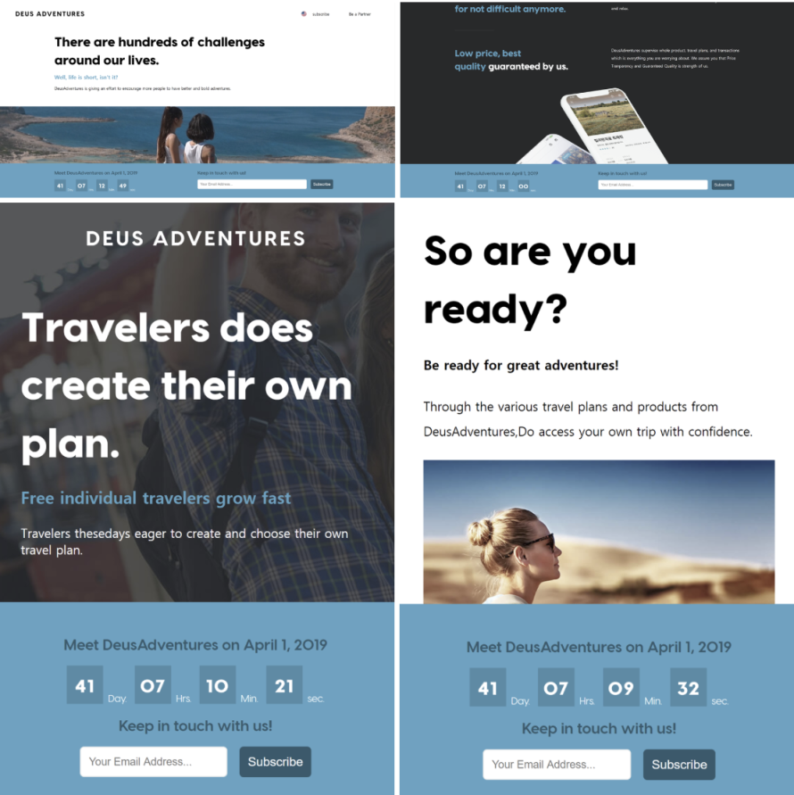
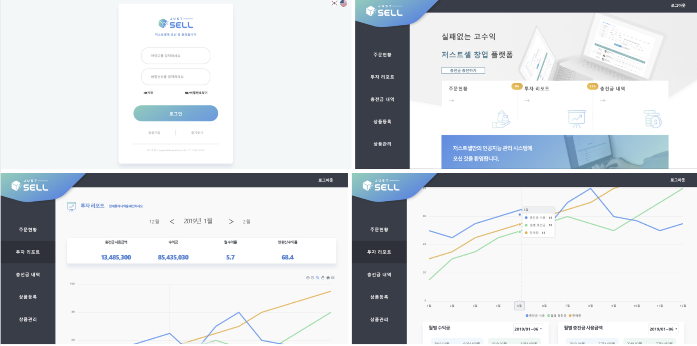
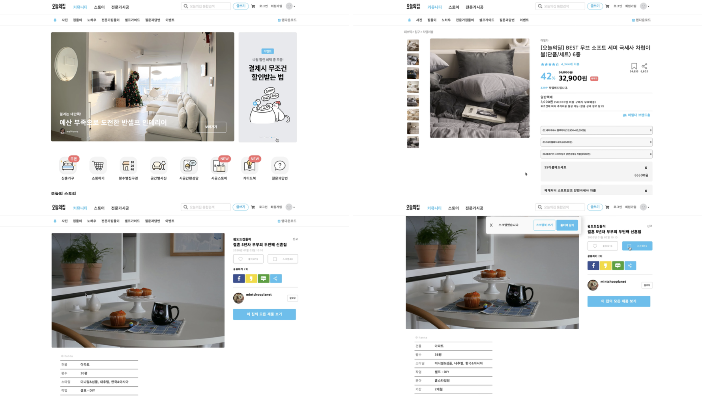

# 조태호 ( Jotang )

안녕하세요!😁 
사람과 인연을 소중하게 여깁니다. 
빠르게 변하는 IT업계에서 빠른 습득력과 응용력을 기반으로 새로운 기술을 알아가는 것을 좋아합니다.
React 개발 환경에 관심이 많고 이를 활용해 개발하는 것에 흥미를 느낍니다.
사용자들이 접속했을 때 즐거움을 느낄 수 있는 Interactive Web 개발에 관심이 많습니다.

|               |                             |
| :-----------: | --------------------------- |
| **Portfolio** | https://taeho.netlify.com   |
|  **Github**   | https://github.com/taeho-jo |
|   **Blog**    | https://taeho-jo.github.io  |
|  **E-mail**   | jotang3726@gmail.com        |

## 🛠 사용 기술

### HTML, CSS

- Semantic MarkUp을 준수합니다.
- Document Object Model(DOM)을 이해하고 있습니다.
- CSS3, SASS, Styled-Components를 사용합니다.
- float, flex, grid에 대해 알고 있습니다.
- Responsive Web을 이해하고 있습니다.

### Javascript

- ES5와 ES6 이후의 문법에 익숙합니다.
- Promise, async/await 비동기 처리를 이해하고 있습니다.

### React

- SPA를 이해하고 있습니다.
- props와 state에 대해 이해하고 사용할 줄 압니다.
- LifeCycle method를 적절한 상황에 사용할 줄 압니다.
- 전역상태관리(Redux, MobX)를 이용한 경험이 있습니다.
- Hooks를 사용할 줄 압니다.

### 기타

- next.js의 사용경험이 있고, SSR과 SEO에 대하여 이해하고 있습니다.
- Version Control(Git)을 이용한 협업에 익숙합니다.
- firebase 인증기능을 이용한 경험이 있습니다.
- typescript, react-native를 학습 중입니다.

## 💻 개발 경력

### weCode(위코드)

##### - 2019.11 ~ 2020.02

## Internship ( 20.01.28 ~ 20.02.21 )

### DeusAdventures(데우스어드벤처스)

[Launcher github](https://github.com/taeho-jo/deus_teaser) & [Homepage](http://deusadventures.com/) / [auth github](https://github.com/taeho-jo/deus_adventures) & [youtube](https://youtu.be/8cSX7J_tbAo)

**Description**

런칭 전 Launcher Page를 React로 리뉴얼을 하였고, 실제 web site 제작 전 기초세팅과
Auth기능의 구조를 잡았습니다.
Launcher Page는 responsive web으로 작업하여 반응형에 대해 더욱 잘 이해 할 수 있었습니다.
next.js 초기 세팅을 진행하면서 next.js를 더 이해할 수 있었고, 전역관리로는 mobx를 사용하였습니다.
인증부분의 구조를 잡으며 firebase의 이메일, 소셜 로그인, 비밀번호 찾기 등의 인증기능을 이용하였습니다.

**I Did**

- React를 이용한 Launcher page 리뉴얼
- i18n 라이브러리를 통한 언어 전환
- Responsive Web
- next.js 초기 세팅 및 구조잡기 진행 (mobX 적용, next-i18next)
- firebase를 통한 인증 기능(email, facebook, google Login & password 찾기)

**Stack**

React, next.js, mobX, styled-components

## 2차 Project ( 20.01.06 ~ 20.01.17 )

### JustSell [(github)](https://github.com/wecode-bootcamp-korea/justSell_frontend)

**Description**

JustSell은 상품 유통 운영 관리 서비스로 next.js를 사용하였습니다.
SSR과 SEO에 대해 이해하게 되었고, 라이브러리의 사용 대신 redux를
이용하여 언어전환을 하면서 redux에 대해 이해를 하였습니다.

**I Did**

- 공통 nav 작업
- Login 기능 구현
- Redux를 이용한 언어 전환
- Version Control(Git)을 이용한 협업
- chart library 이용하여 통계 그래프 구현

**Stack**

next.js, redux, styled-components

<!-- 

 -->

## 1차 Project ( 19.12.23 ~ 20.01.03 )

### weHome [(github)](https://github.com/wecode-bootcamp-korea/weHome_frontend) / [(youtube)](https://youtu.be/AZ71h90ajN0)

**Description**

weHome은 오늘의 집 clone Project로 props와 state를 이해하게 되었고,
API를 주고받으며 life cycle method에 대한 이해를 하였습니다.
layout구조를 잡으며 flex-box를 이해 할 수 있었습니다.

**I Did**

- 집들이 상세 page & 상품 상세 page
- 댓글 pagination
- 제품 상세 옵션 선택 기능

**Stack**

react, scss

## 🏢 이전 경력

### 서원유통 ( 14.08 ~ 19.08 )

## 🎓 학력

|            |                        |
| :--------: | ---------------------- |
| **학교명** | 김해 인제대학교        |
|  **기간**  | 08.03 ~ 15.02          |
|  **전공**  | 국제경상학부(무역전공) |

