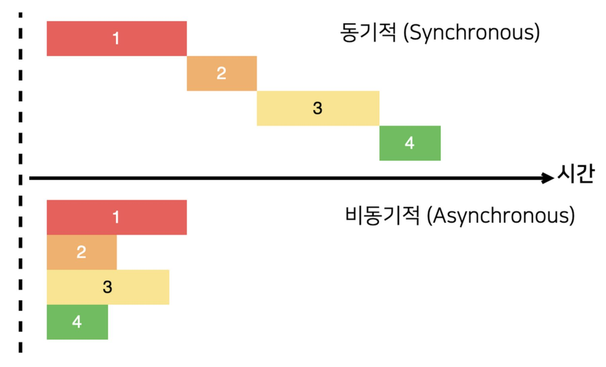
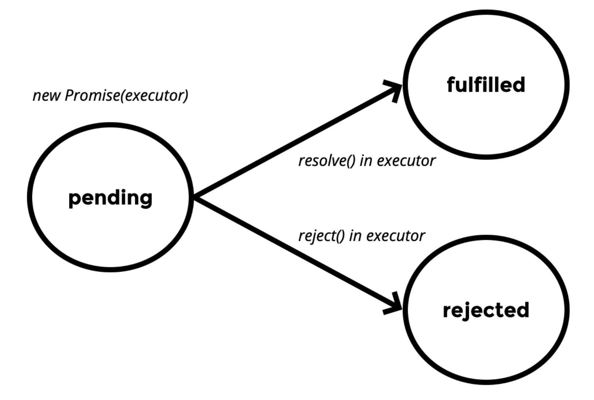

# 동기 & 비동기



- **동기적(Synchronous)** : 코드의 실행이 한줄 한줄 실행된다. 따라서 작업을 동기적으로 처리하게 된다면, 작업이 끝날 때까지 기다리는 동안 다른 작업은 중지 상태가 되어 처리 할 수 없게 된다. 하나의 작업이 끝나야 다음 작업이 실행된다.

- **비동기적(Asynchronous)** : 코드이 실행이 동시에 실행된다. 작업의 흐름이 멈추지 않기 때문에 여러 가지 작업을 처리할 수 있다. 또 하나의 작업을 기다리는 과정에서도 다른 함수가 중지 상태가 되는 것이 아니라 다른 작업도 실행하게 된다. 기다렸던 작업이 완료되면 돌아가서 실행을 하게 된다.

### 비동기 처리를 하는 고전적인 방법

#### 콜백함수

```js
first (function (data) {
 ... 먼저 실행할 작업 ...
 second (function (data) {
  ... first 함수가 성공했을 때 실행할 작업 ...
  third (function (data) {
   ... second 함수가 성공했을 때 실행할 작업 ...
   fourth (function (data) {
    ... third 함수가 성공했을 때 실행할 작업 ...
   }
  }
 }
})
```

이러한 콜백함수는 비동기 작업이 여러 번 이어지는 경우 콜백함수의 중첩이 많아져 하나의 함수가 너무 복잡하게 되는 경향이 있다. 이러한 문제를 `콜백 지옥` 이라고 한다.
이러한 문제를 해결하는 것이 `Promise 객체`의 역할

# Promise

ES6 부터 JavaScript의 표준 내장 객체로 추가.

```js
console.log(Promise); // [Function: Promise]
```

## Promise 만들기

- 생성자를 통해 Promise 객체를 만들 수 있다.

```js
new Promise(// executor라는 함수를 인자로 받는다.)
```

- executor 함수는 resolve와 reject를 인자로 갖는다. 여기서 resolve와 reject는 함수이다.

```js
new Promise((resolve, reject)=>{...})

// Promise의 생성주기

// 1. Promise를 생성하게 되면 pending(대기) 상태
new Promise((resolve, reject)=>{...})

// 2. resolve 함수를 실행하게 되면, fulfilled(이행)상태
new Promise((resolve, reject)=>{
  resolve();
})

// 3. reject 함수를 실행하게 되면, rejected(거부) 상태
new Promise((resolve, reject)=>{
  reject();
})
```



- 1초후에 fulfilled 상태가 되게 하기

```js
new Promise((resolve, reject) => {
  setTimeout(() => {
    resolve();
  }, 1000);
});
```

- Promise fulfilled 이후 then을 이용해 callback 함수 실행

```js
// 변수
const prom = new Promise((resolve, reject) => {
  setTimeout(() => {
    resolve();
  }, 1000); // 1초 후에 resolve가 실행되면서 fulfilled상태가 된다.
});

// fulfilled 상태가 되는 시점에 then 안에 설정한 callback 함수 실행
prom.then(() => {
  console.log('resolve된 이후에 실행'); // fulfilled 상태가 되고 나서 실행
});

// 함수
function func() {
  return new Promise((resolve, reject) => {
    setTimeout(() => {
      resolve();
    }, 1000); // 1초 후에 resolve가 실행되면서 fulfilled상태가 된다.
  });
}

// fulfilled 상태가 되는 시점에 then 안에 설정한 callback 함수 실행
func().then(() => {
  console.log('이것도 resolve된 이후에 실행'); // fulfilled 상태가 되고 나서 실행
});
```

- then을 설정하는 시점을 정확하게 하고, 함수의 실행과 동시에 Promise 객체를 만들면서 pending 상태가 되도록 하기 위해서 Promise 객체를 생성하면서 return 하는 함수(func)를 만들어 func()과 동시에 then을 설정

- reject 역시 resolve와 마찬가지. 다만 catch를 사용하게 된다.

```js
function func () {
 return new Promise((resolve, reject) => {
  setTimeout(() => {
  	reject();
  },1000)
 })
}


func()
  .then(() => {
 console.log("이것도 resolve된 이후에 실행")
})
  .catch(() => {
 console.log("이것은 reject!!)
})
```

## resolve와 reject로 인자 넘겨주기

- Promise가 인자로 받는 executor 함수의 reslove와 reject를 실행할 때, 인자를 넣어 실행하면, then & catch의 callback 함수의 인자로 받을 수있다.

```js
// resolve
function func() {
  return new Promise((resolve, reject) => {
    console.log('요시땅');
    setTimeout(() => {
      resolve('안녕 난 resolve라고 해~');
    }, 1000);
  });
}
func().then(message => {
  console.log(message);
});

// reject
function func() {
  return new Promise((resolve, reject) => {
    console.log('요시땅');
    setTimeout(() => {
      reject('안녕 난 reject라고 해~');
    }, 1000);
  });
}
func().catch(message => {
  console.log(message);
});
```

- reject 함수를 실행하면서는 일반 문자열이 아니라, rejected 되는 이유를 넘기게 되는데, 표준 내장 객체인 Error의 생성자를 이용하여 Error객체를 만들어 넘겨준다.

```js
function func() {
  return new Promise((resolve, reject) => {
    console.log("요시땅");
    setTimeout(() => {
      reject(new Error("이유를 적어주세요");
    }, 1000);
  });
}
func()
  .catch(error => {
  console.log(error);
});

// Error: 이유를 적어주세요
//    at Timeout._onTimeout //(c:\Users\Jotang\Desktop\blog\console\aaa.js:18:14)
//    at listOnTimeout (internal/timers.js:531:17)
//    at processTimers (internal/timers.js:475:7)
```

#### then & catch 함께 사용 / finally

```js
const func = () => {
  return new Promise((resovle, reject) => {
    const a = 1;
    const b = 1;
    console.log('자 실행합니다');
    if (a === b) {
      setTimeout(() => {
        resovle('똑같습니다');
      }, 1000);
    } else {
      setTimeout(() => {
        reject(new Error('값이 다릅니다'));
      }, 1000);
    }
  });
};

func()
  .then(res => {
    console.log(res);
  })
  .catch(err => {
    console.log(err);
  })
  .finally(() => {
    console.log('최종적으로 실행');
  });
```

- a와 b의 값이 같다면 resolve가 실행되며 fulfilled상태가 되고, 값이 같지 않다면 reject가 실행되어, rejected상태가 된다.

- `finally()` 를 사용하여 fulfilled 또는 rejected 된 후에 최종적으로 실행할 것을 작성한다. finally의 인자로는 함수를 넣는다.

## Promise 객체 Chaining

- then 함수에서 다시 Promise 객체를 return 하는 방법을 통해 chaining이 가능하다. 비동기 작업을 순차적으로 아래로 표현할 수 있게 된다.

```js
function func() {
  return new Promise((resolve, reject) => {
    console.log('요시땅');
    setTimeout(() => {
      resolve('안녕 난 resolve라고 해~');
    }, 1000);
  });
}
func()
  .then(() => {
    return func();
  })
  .then(() => func())
  .then(func)
  .then(() => {
    console.log('나는 4초후에 실행');
  });

// 1초마다 요시땅이 console에 나오고,
// 마지막 4초후에는 "나는  4초후에 실행" 이 나오게 된다.
```

# Promise 생성자를 만드는 다른 방법

### Promise.resolve()

- `new Promise()`는 executor 함수를 인자로 받아 Promise객체를 생성하였지만, 이번에는 `Promise.resolve()`를 이용한다.
- 어떠한 객체가 Promise 객체인지, 그냥 Data 객체인지 모르거나 확실하지 않을 때, Promise.resolve()를 통해 한번 실행한 후에 넘기게 된다.
- 받아오는 value의 값이 promise 객체인지 아닌지 알 수 없는 경우 사용하게 되면, 연결되어있는 그 후에 있는 then 메서드를 실행하게 된다.

```js
const a = new Promise((resolve, reject) => {
  setTimeout(() => {
    resolve('promise');
  }, 2000);
});
const b = 'value';

// 인자가 promise 객체인 경우
Promise.resolve(a).then(data => {
  console.log('인자가 promise 객체인 경우', data);
});

// 인자가 promise 객체가 아닌 경우
Promise.resolve(b).then(data => {
  console.log('인자가 promise 객체가 아닌 경우', data);
});
```

- 변수 a는 Promise 객체이고, 변수 b는 Promise 객체가 아니다.
- console을 확인하게 되면,

```js
// 인자가 promise 객체가 아닌 경우 value -> 먼저 출력
// 인자가 promise 객체인 경우 promise -> 1초 후에 출력
```

- Promise 객체가 맞다면, resolve가 된 then 메서드를 실행하게 되고, Promise 객체가 아니라면, value를 인자로 보내면서 then 메서드를 실행하게 된다.

### Promise.reject()

- 바로 reject를 하는 경우는 거의 없기 때문에, 사용법만 알아보도록 하겠다.

```js
Promise.reject(new Error('reject 되었슴둥'))
  .then(err => {})
  .catch(err => {
    console.log(err);
  });
```

### Promise.all()

- 여러가지의 비동기 작업을 동시에 시작해서 모든 작업이 다 끝난 후에 처리할 것이 있을때
- 프로미스 객체 여러개를 생성하여, 배열로 만들어 인자로 넣고, promise.all을 실행
- 배열의 모든 프로미스 객체들이 fulfilled 되었을 때, then 의 함수가 실행
- then 의 함수의 인자로 프로미스 객체들의 resolve 인자값을 배열로 돌려줌

```js
function func(ms) {
  return new Promise((resolve, reject) => {
    setTimeout(() => {
      resolve(ms);
    }, ms);
  });
}

Promise.all([func(1000), func(2000), func(3000), func(4000)]).then(mes => {
  console.log('모두 fulfilled 된 이후에 실행', mes);
});

// 모두 fulfilled 된 이후에 실행 [ 1000, 2000, 3000, 4000 ]
```

### Promise.race()

- 프로미스 객체를 여러개 생성하여, Promise.race()에 배열로 만들어 인자를 넣어주게 되면, 배열의 모든 Promise 객체들 중에 가장 먼저 fulfilled 된 것으로 then 함수가 실행된다.
- then 함수의 인자로 가장 먼저 fulfilled된 Promise 객체의 resolve인자 값을 돌려준다.

```js
function func(ms) {
  return new Promise((resolve, reject) => {
    setTimeout(() => {
      resolve(ms);
    }, ms);
  });
}

Promise.race([func(1000), func(2000), func(3000), func(4000)]).then(data => {
  console.log('제일 처음 fulfilled된 이후 실행', data);
});

// 제일 처음 fulfilled된 이후 실행 1000
```

##### JavaScript에서 비동기처리를 하기 위해서 가장 기본이 되는 개념이 Promise이다.
