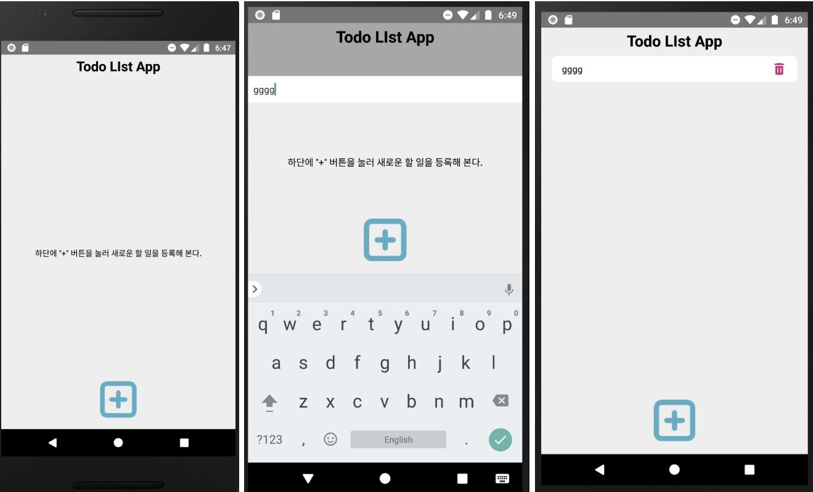

# react-native todoList App

Context API를 이용하여 todoList App을 만들어보려고 합니다.
할 일을 입력하게 되면, AsyncStorage에 데이터를 저장하려고 합니다.

# Context API

- redux와 mobX와 같은 전역상태관리를 할 수 있게 해준다.
- 전역에서 사용할 데이터를 context에 저장한 후, 필요한 컴포넌트에서 해당 데이터를 불러와 사용한다.
- createContext, provider, useContext를 사용한다.

### 해당 project에서 context type 정해주기

- @type/index.d.ts 파일에 타입을 지정해주게 되면, 프로젝트 전반에 걸쳐 타입을 사용할 수 있게 된다.

```tsx
interface ITodoListContext {
  todoList: Array<string>; // todoList는 string인 array
  addTodoList: (todo: string) => void;
  // addToList는 string인 todo를 인자로 받는 함수
  removeTodoList: (index: number) => void;
  // addToList는 number인 index를 인자로 받는 함수
}
```

### createContext

- createContext로 Context를 생성한다.

```tsx
import React, { createContext, useState, useEffect } from 'react';
import AsyncStorage from '@react-native-community/async-storage';

interface Props {
  children: JSX.Element | Array<JSX.Element>;
}

const TodoListContext = createContext<ITodoListContext>({
  todoList: [],
  addTodoList: (todo: string): void => {},
  removeTodoList: (index: number): void => {},
});

const TodoListContextProvider = ({ children }: Props) => {
  const [todoList, setTodoList] = useState<Array<string>>([]);

  const addTodoList = (todo: string): void => {
    const list = [...todoList, todo];
    setTodoList(list);
    AsyncStorage.setItem('todoList', JSON.stringify(list));
  };
  // 할 일을 추가하는 함수
  // 기존의 todoList를 ...todoList하여 복사한 후, 인자로 받은 todo를 추가해준다.
  // AsyncStorage에 JSON.stringfy()를 사용하여 문자열로 변경한 후에 todoList라는 key값으로 list를 저장한다.

  const removeTodoList = (index: number): void => {
    let list = [...todoList];
    list.splice(index, 1);
    setTodoList(list);
    AsyncStorage.setItem('todoList', JSON.stringify(list));
  };
  // 할 일을 삭제하는 함수
  // 기존의 배열인 todoList를 ...todoList하여 복사한 후, splice를 통해 삭제한다.
  // setTodoList(list)를 통해 todoList의 상태를 업데이트 해준 후, AsycStorage도 업데이트 한다.

  const initData = async () => {
    try {
      const list = await AsyncStorage.getItem('todoList');
      if (list !== null) {
        setTodoList(JSON.parse(list));
      }
    } catch (e) {
      console.log(e);
    }
  };
  // App이 실행될 때, AsyncStorage에서 todoList를 가져온다. async/await을 사용하여 비동기처리를 한다.

  useEffect(() => {
    initData();
  }, []);
  // componentDidMount와 같이 useEffect를 사용하여, 랜더링 후 실행하도록 한다.

  return (
    <TodoListContext.Provider
      value={{
        todoList,
        addTodoList,
        removeTodoList,
      }}
    >
      {children}
    </TodoListContext.Provider>
  );
};
// props로 전역 상태를 전달해 준다.

export { TodoListContextProvider, TodoListContext };
```

### provider로 감싸기

```tsx
import React from 'react';
import styled from 'styled-components/native';

import { TodoListContextProvider } from '~/context/TodoListContext';

import Todo from './screens/Todo';

const App = () => {
  return (
    <TodoListContextProvider>
      <Container>
        <Todo />
      </Container>
    </TodoListContextProvider>
  );
};

export default App;
```

### useContext

```tsx
import React, { useContext } from 'react';
import { FlatList } from 'react-native';
import styled from 'styled-components/native';
import { TodoListContext } from '~/context/TodoListContext';

import EmptyItem from './EmptyItem';
import TodoItem from './TodoItem';

interface Props {}

const TodoList = ({  }: Props) => {
  const { todoList, removeTodoList } = useContext<ITodoListContext>(
    TodoListContext
  );
  // TodoListContext 안에서 사용하고자 하는 todoList와 removeTodoList를 불러와 사용한다.

  return (
    <Container
      data={todoList}
      keyExtractor={(item, index) => {
        return `todo-${index}`;
      }}
      ListEmptyComponent={<EmptyItem />}
      renderItem={({ item, index }) => (
        <TodoItem
          text={item as string}
          onDelete={() => removeTodoList(index)}
        />
      )}
      contentContainerStyle={todoList.length === 0 && { flex: 1 }}
    />
  );
};

export default TodoList;

const Container = styled(FlatList)``;

// FlatList component는 밑에서 알아보도록 하겠다.
```

# FlatList

FlatList components는 심플한 api, 높은 퍼포먼스, 편리한 기능지원을 하는 **리스트 컴포넌트**

- react의 배열내장함수인 map()과 같은 역할
- 데이터가 변경되면 리액트에 의해 알아서 리렌더한다.
- data에 뷰에 표시할 데이터의 배열을 넘겨주면 된다.

#### FlatList 속성

- **data** : 리스트 뷰에 표시할 데이터의 배열을 전달해 준다.

- **keyExtractor** : react의 map()에서 **key를 설정해주는 것과 같다**.

- **ListEmptyComponent** : 주어진 배열(data)에 데이터가 없을 경우 표시되는 컴포넌트.
- **renderItem** : 주어진 배열에 데이터를 사용하여 반복적으로 표시될 컴포넌트.
- **contentContainerStyle** : `todoList.length === 0 && {flex: 1}` ListEmptyComponent 친구의 스타일을 정의

# TouchableWithoutFeedback

- 아무 액션을 원하지 않을 경우

#### 기타 Touch 관련 component

- **TouchableHighlight**: 버튼, 링크. 누르는 순간 뷰의 배경이 어두워짐
- **TouchableNativeFeedback(android)**: 터치에 반응
- **TouchableOpacity**: 버튼의 불투명도. 누르고 있는 동안 배경이 불투명해짐
- **TouchableWithoutFeedback**: 탭 동작은 처리하나 피드백을 표시하지 않을때 사용
- **onLongPress**: 일정 시간 동안 누르고 있으면 볼 수 있다.

# KeyboardAvoidingView

- 이 컴포넌트는 화면의 뷰들이 가상 키보드에 가려져서 보이지 않는 경우를 벗어나게 해준다.
- 키보드의 위치에 따라서 height, position, bottom padding을 자동적으로 저절해준다.

### 완성된 TodoApp


