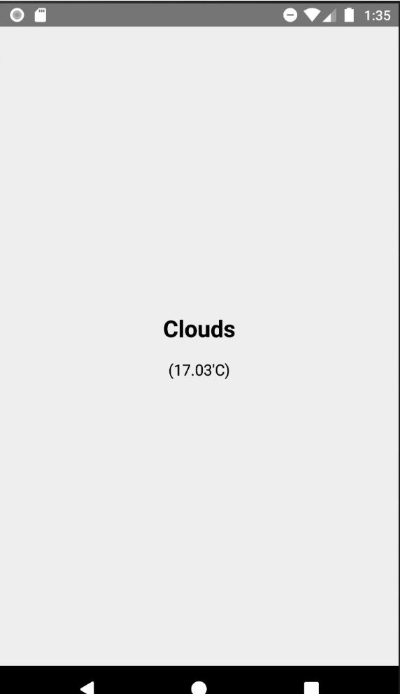

# Weather App

현재 위치의 정보를 받아와서 날씨를 간단하게 표시하는 앱을 만들어 보려고한다.

##### 굉장히 간단한 앱이기에 구조적으로 복잡한 것은 없다.

##### 완성모습



# Weather API / 위치 정보

날씨 데이터를 가져오기 위해서 OpenWeather에서 제공하는 날씨 API를 사용.
[OpenWeather](https://openweathermap.org/api)

위치정보는 react-native-geolocation-service 라이브러리를 사용.
`npm install --save react-native-geolocation-service`

- 안드로이드에서 권한 설정을 하기 위해 `./android/app/src/main/AndroidManifest.xml` 파일을 수정한다.

```js
<manifest
  xmlns:android="http://schemas.android.com/apk/res/android"
  package="com.weatherapp"
>
  <uses-permission android:name="android.permission.INTERNET" />
  <uses-permission android:name="android.permission.ACCESS_FINE_LOCATION" />
  ... ...
</manifest>
```

- 위치 정보가 필요한 곳에서 다음과 같이 사용하여 위치 정보를 얻을 수 있다.

```js
import Geolocation from 'react-native-geolocation-service`;
...
Geolocation.getCurrentPosition(
  position => {
    ...
  },
  error => {
    ...
  }
 );
```

# Weather View Component

```js
import React, {useState, useEffect} from 'react';
import styled from 'styled-components/native';
import {FlatList, Alert} from 'react-native';
import Geolocation from 'react-native-geolocation-service';

interface Props {}

const API_KEY = '비밀쓰비밀쓰비밀쓰비밀쓰';

interface IWeather {
  temperature?: number;
  weather?: string;
  isLoading: boolean;
}

const WeatherView = ({}: Props) => {
  const [weatherInfo, setWeatherInfo] = useState<IWeather>({
    temperature: undefined,
    weather: undefined,
    isLoading: false,
  });

  // 해당 위치의 날씨 정보를 가져오기 위한 함수
  // 두 곳에서 호출하도록 설정하여, 당겨서 갱신하기 기능을 사용.
  const getCurrentWeather = () => {
    setWeatherInfo({
      isLoading: false,
    });

    // 현재 위치의 위도(latitude)와 경도(longitude)를 가져옴
    Geolocation.getCurrentPosition(
      position => {
        const {latitude, longitude} = position.coords;

        // 가져온 위치 정보를 사용하여 Fecth API 사용
        fetch(
          `http://api.openweathermap.org/data/2.5/weather?lat=${latitude}&lon=${longitude}&APPID=${API_KEY}&units=metric`,
        )
          .then(res => res.json())
          .then(json => {
            setWeatherInfo({
              temperature: json.main.temp,
              weather: json.weather[0].main,
              isLoading: true,
            });
          })
          .catch(error => {
            setWeatherInfo({
              isLoading: true,
            });
            showError('날씨 정보를 가져오는데 실패하였다.');
          });
      },

      // 위치 정보를 가져오지 못하면 error
      error => {
        setWeatherInfo({
          isLoading: true,
        });
        showError('위치 정보를 가져오는데 실패했다.');
      },
    );
  };

  const showError = (message: string): void => {
    setTimeout(() => {
      Alert.alert(message);
    }, 500);
  };

  // 화면 렌더링 이후 날씨 데이터를 가져옴. componentDidMount와 같음
  useEffect(() => {
    getCurrentWeather();
  }, []);

  let data = [];
  const {isLoading, weather, temperature} = weatherInfo;
  if (weather && temperature) {
    data.push(weatherInfo);
  }

  return (
    <Container>
      <FlatList
        onRefresh={() => getCurrentWeather()}
        refreshing={!isLoading}
        data={data}
        keyExtractor={(item, index) => {
          return `Weather-${index}`;
        }}
        ListEmptyComponent={
          <LoadingView>
            <Loading size="large" color="#1976d2" />
            <LoadingLabel>Loading...</LoadingLabel>
          </LoadingView>
        }
        renderItem={({item, index}) => (
          <WeatherItemContainer>
            <Weather>{(item as IWeather).weather}</Weather>
            <Temperature>({(item as IWeather).temperature}'C)</Temperature>
          </WeatherItemContainer>
        )}
        contentContainerStyle={{flex: 1}}
      />
    </Container>
  );
};

export default WeatherView;

// styled-components 부분은 생략
```

```js
// error 메세지를 표시하는 함수
const showError = (message: string): void => {
  setTimeout(() => {
    Alert.alert(message);
  }, 500);
};
```

- setTimeout을 사용한 이유는 setWeatherInfo를 사용하여 state를 업데이트하여 화면을 재렌더하지만, Alert.alert에 의해 화면이 갱신되지 않는 문제를 해결하기 위해 비동기로 처리하였다.

# FlatList 당겨서 갱신하기 기능

## onRefresh

`onRefresh`에 당겨서 갱신할 때, 호출할 함수를 정의.

- `refreshing`에는 당겨서 갱신하기 기능을 사용하여 데이터를 갱신 중인지, 데이터 갱신이 끝났는지를 알려주기 위한 Boolean 값을 설정한다.

- 이렇게 두 값을 설정하면 당겨서 갱신하기 기능을 사용할 수 있다.
