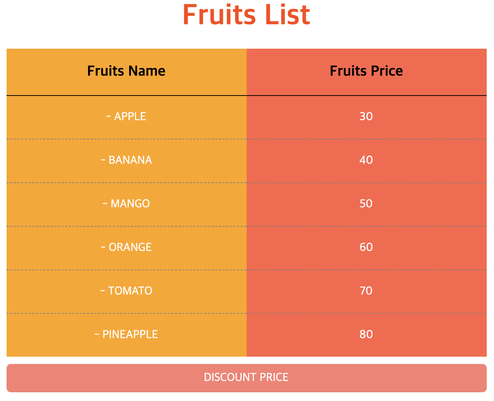

# Vuex란?

Vuex는 Vue와 함께 사용하기 위한 `상태 관리 패턴` 라이브러리 이다.

react에서 사용하는 redux, context API, mobx와 같다고 생각하면 된다.

앱의 모든 구성 요소에서 엑세스할 수 있는 중앙 집중식 데이터 저장소를 만드는 것이다.

### vuex 설치

vue-cli를 설치할 때, vuex도 같이 설정해준다.

### scss 사용

```
npm install --save-dev node-sass sass-loader
```

scss 관련 모듈을 설치해준다.

사용방법은 매우 간단하다.

```js
<style lang='scss'>
  // 바로 작성 가능
</style>

// style 파일을 따로 만들어 import
<style lang='scss' src='@/styles/app.scss"></style>
```

`@`는 src 폴더를 의미한다.

# store 생성


store 폴더를 생성하고, index.js를 생성한다.

- store의 기본 구조

```js
import Vue from 'vue';
import Vuex from 'vuex';

Vue.use(Vuex);

export const store = new Vuex.Store({
  state: {},
  mutations: {},
  actions: {},
  modules: {},
});
```

> state는 Vue에서 data를 정의해주는 것과 같다고 생각하면 된다.

Store를 앱에서 사용하기 위해서 저장소 정보를 상수 store에 할당한 뒤에 export한다.

이렇게 내보낸 정보는 `main.js`에서 받아 사용하게 된다. Store에서 작성한 `Vue.use(Vuex)`에 의해서 `store` 속성을 사용할 수 있게된다.

```js
// main.js
import Vue from 'vue';
import App from './App.vue';
import { store } from './store';

Vue.config.productionTip = false;

new Vue({
  store,
  render: h => h(App),
}).$mount('#app');
```

store를 생성하였기 때문에 각 컴포넌트가 실행될 때, props를 사용하지 않아도 된다.

```js
<script>
export default {
// 기존 props는 삭제
// props: ['fruits']
  computed: {
    fruits() {
      return this.$store.state.fruits;
    }
  }
};
</script>

```

`computed` 속성을 추가하여 Store에서 데이터를 가져와서 바인딩한다.
저장소에서 State가 변경되면, computed가 변경되고, DOM 업데이트가 된다.

### getters

state를 계산된 상태로 사용할 경우 `getters`를 사용할 수 있다.

`computed`속성과 비슷하다

다만, store의 state를 컴포넌트에서 computed에서 직접 계산하여 사용하지 않도록 주의해야한다

### mutations

store의 state를 변경하는 방법

버튼을 클릭했을 때, 과일의 가격을 변이(mutations)를 적용해보려고 한다.

먼저 버튼 컴포넌트를 생성하고 import해서 렌더링 한다.

```html
<!-- BtnDiscount component -->
<template>
  <div class="btn">DISCOUNT PRICE</div>
</template>
```

store에서 mutations를 정의한다.

```js
export const store = new Vuex.Store({
  state: {
    fruits: [
      ...
    ]
  },
  getters: {
    ...
  },
  mutations: {
    discountPrice(state) {
      state.fruits.forEach(fruit => {
        fruit.price *= 0.9;
      });
    }
  }
});
```

**discountPrice** : 클릭이 될 때, 받아온 현재 state의 price값에서 10%씩 할인하는 함수

클릭이 되었을 때, 이벤트가 발생하기 때문에 BtnDiscount에 이벤트를 추가해준다.
`mutations는 직접 호출할 수 없다. commit method를 이용하여 호출`

```html
<template>
  <div class="btn" @click="discountPrice">DISCOUNT PRICE</div>
</template>
```

```js
<script>
  export defalut {
    methods: {
      discountPrice() {
        this.$store.commit('discountPrice')
      }
    }
  }
</script>
```

### payload

`commit` 에서 할인율을 직접 입력할 수 있도록 `payload`라는 인자를 이용하여 호출을 해보려고한다.

```js
<script>
  export defalut {
    methods: {
      discountPrice() {
        this.$store.commit('discountPrice', {
          discountRate: 20
        })
      }
    }
  }
</script>
```

값이 어떤 의미를 가지고 payload로써 전달되는지 정확하게 나타내기 위해서 객체로 작성.

store의 mutations이 payload를 인자로 받을 수 있도록 코드를 수정한다.

```js
export const store = new Vuex.Store({
  ...
  mutations: {
    discountPrice(state, payload) {
      state.fruits.forEach(fruit => {
        fruit.price *= (100 - payload.discountRate) / 100
      });
    }
  }
});
```

### actions

Vue의 actions는 mutations와 비슷하다고 볼 수 있다.

mutations는 state관리에 초점을 둔다. 비동기 작업이 포함된 상태로 컴포넌트들에서 mutations가 일어난다면 프로그램 흐름을 추적하기가 어려워 진다.

이 때, actions을 만들어서 비동기 작업을 구분해야한다.

**Mutations** : `동기적 작업 처리`

**Actions** : `비동기적 작업 처리`

2초 후에 할인이 될 수 있도록 actions를 store에 정의하도록 한다.

```js
export const store = new Vuex.Store({
  ...
  mutations: {
    discountPrice(state, payload) {
      state.fruits.forEach(fruit => {
        fruit.price *= (100 - payload.discountRate) / 100
      });
    }
  },
  actions: {
    discountPrice(context, payload) {
      setTimeout(() => {
        context.commit('discountPrice', payload)
      }, 2000)
    }
  }
});
```

버튼 컴포넌트에서 mutations말고 action을 호출한다.

```js
<script>
  export defalut {
    methods: {
      discountPrice() {
        this.$store.dispatch('discountPrice', {
          discountRate: 20
        })
      }
    }
  }
</script>
```

- action을 호출하기 위해서는 commit 말고 `dispatch` method를 사용한다.

- action은 `context`라는 인자를 갖는다. context는 store안에 있는 state, getters, commit등에 접근 할 수 있다.

- commit을 자주 사용해야하는 경우에는 비구조할당이 가능하다.

```js
actions: {
  discountPrice({ commit }, payload) {
    setTimeout(() => {
      ...
    }, 2000)
  }
}
```

### helpers(mapping)

helpers는 컴포넌트의 computed, methods 속성에 vuex store 내용을 바인ㄴ딩하여 좀 더 직관적으로 사용할 수 있게 도와준다.

Vuex에서ㅓ 사용하는 state, getters, mutations, actions 를 mapping할 수 있다.

- **mapState**
- **mapGetters**
- **mapMutations**
- **mapActions**

먼저 FruitsList를 수정한다.
state, getters를 바인딩 하기 위해서 ` mapState`,`mapGetters `를 사용하였다.

```js
<script>
import { mapState, mapGetters } from "vuex";

export default {
  computed: {
    ...mapState(["fruits"]),
    ...mapGetters(["upperCaseFruits"])
  }
};
</script>
```

객체의 속성이나 메소드 자리에서는 함수 실행을 할 수 없는데, 함수 앞에 `Spread 연산자(...)`를 사용하면, 객체의 일부로 확장해서 사용할 수 있다.

- spread연산자로 인해서 문제가 있다면 `Babel Preset`이 필요하다.

```js
npm install --save-dev babel-preset-es2015

//.babelrc 파일 생성 후
{
  "preset": ["es2015"]
}
```

**mapActions**로 매핑한 경우 payload를 인자로 직접 사용할 수 없다. 이 때는 별도로 데이터를 만들어서 클릭이벤트 발생 시, 인자로 보낸다.

```html
<template>
  <div class="btn" v-on:click="discountPrice(discountData)">DISCOUNT PRICE</div>
</template>
```

```js
<script>
import { mapActions } from "vuex";

export default {
  data() {
    return {
      discountData: {
        rate: 20
      }
    };
  },
  methods: {
    ...mapActions(["discountPrice"])
  }
};
</script>
```

store에서 받아오는 payload의 속성값도 수정한다.

```js
  mutations: {
    discountPrice(state, payload) {
      state.fruits.forEach(fruit => {
        fruit.price *= (100 - payload.rate) / 100;
      });
    }
  }
```

- 매핑한 이름이 최적하가 아니거나 적당하지 않다면, 컴포넌트 안에서 매핑하는 메소드의 이름을 변경하여 사용할 수 있다.

```js
<script>
import { mapActions } from "vuex";

export default {
  data() {
    ...
  },
  methods: {
    ...mapActions({
      price: 'discountPrice'
    })
  }
};
</script>
```

```html
<div class="btn" v-on:click="price(discountData)">DISCOUNT PRICE</div>
```



##### vuex의 기초와 기본개념에 대해서 알아보았다. 다음시간에는 router에 대해서 알아보고, 실제로 페이지를 만들어보도록 하려고한다.

##### 많이 부족한 내용이니, 틀리거나 다른 내용이 있다면 댓글로 알려주시면 감사드리겠습니다.
