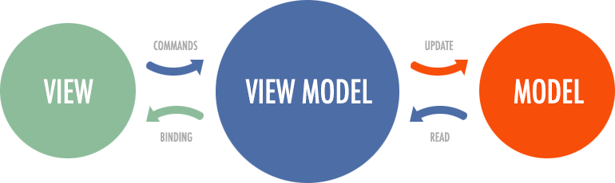
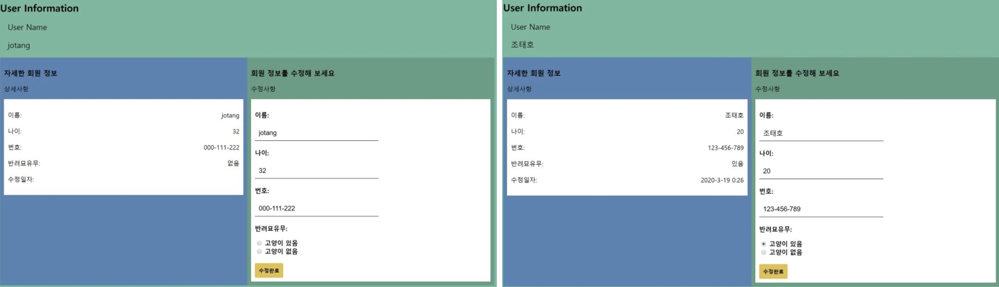
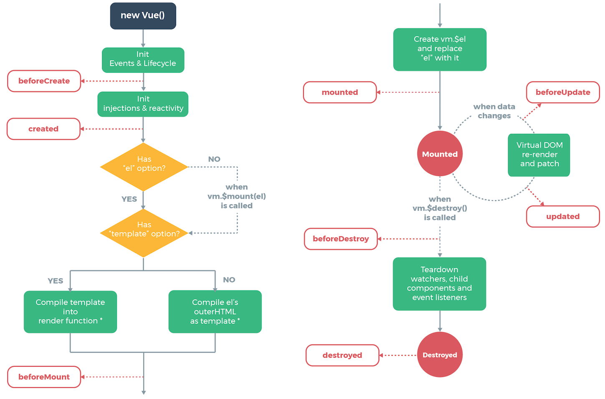

# Vue란 무엇인가?

MVVM 패턴의 ViewModel 레이어에 해당하는 화면 단 라이브러리

#### vue의 특징

- 데이터 바인딩, 화면 단위를 컴포넌트 형태로 제공하고 관련 API를 지원하는데 궁긍적인 목적이 있다.
- Augular에서 지원하는 양방향 데이터 바인딩을 동일하게 제공하지만, **컴포넌트 간의 통신**은 React와 같이 **단방향 데이터 흐름(부모->자식)**을 사용한다.
- 문법이 단순하고 간결하여 Learning Curve가 짧다고한다(...?)

#### MVC, MVP, MVVM 패턴이란?

model과 view 사이의 관계를 어떻게 처리할지에 대한 해결책.
UI(view)와 데이터(model)을 분리하여 작업하고, 상호연계를 하게 되는데, 이 연계 방식이 어떠냐에 따라 나뉘게 된다.

- **model** : **데이터를 가지고 있는 객체**. view에서 데이터를 요청하면, 그에 해당하는 데이터를 **controller를 통해 전달**하고, 데이터의 변동이 일어나면 변동된 데이터로 **갱신을 당하는 역할**.
- **view** : 사용자가 보는 화면, DB에서 받아온 데이터를 가지고 화면에 출력해주거나, 사용자의 입력을 받는 부분
- **Controller** : view와 model사이에서 조율하는 조율자 역할. model의 데이터를 추가하거나 삭제하는 것이 가능하고, model에 존재하는 데이터를 view로 보내주는 중간자 역할.

1. MVC(Model-View-Controller)
   frontend와 backend 부분을 구분하여 개발하는 방식을 말한다.
   서로 영향을 받지 않고 수정이 가능하고, 유지보수에 탁월하다.

2. MVP(Model-View-Presenter)
   MVP패턴의 핵심은 사용자인터페이스(view)와 비지니스로직(model)을 분리하는 것이다. 그리고 서로간의 상호작용을 다른 객체(presenter)에 위임하여 서로의 영향을 최소화 하는 것에 있다. model과 view간의 결합도를 낮추게 되면, 새로운 기능을 추가하거나 변경을 할 때 관련된 부분만 수정하면 되기 때문에 확장성이 좋아진다. 테스트 코드를 작성하기 편리해지기 때문에 앙ㄴ전한 코드 작업이 가능해 진다.

3. MVVP(Model-View-ViewModel)
   
   ViewModel : 특정한 Data조회 모듈을 이용하여 필요로 하는 자신의 속성값을 채움.
   view는 자기가 표현하고자 하는 속성값을 가지고 있는 viewModel을 불러 UI를 출력한다.
   model은 data를 조회하는 부분을 담당하거나, data를 조회하여 특정 model 또는 viewModel을 만든다.
   MVC패턴의 방식에서 출발하였다. 간단하게 생각한다면, front의 화면 동작 관련 로직과 back의 DB데이터 처리 및 서버 로직을 분리하고, back에서 넘어오는 data를 model에 담아 view로 넘겨주는 중간 지점이라고 보면 된다.

# Vue 시작하기

오늘은 vue를 만나는 첫 날이기 때문에, 설치를 진행하고 간단한 작업을 진행해보려고 합니다.

먼저 저는 Vue CLI를 사용하였습니다.

> npm install -g @vue/cli

프로젝트를 생성합니다.

> vue create firstVue


오늘 완성할 친구의 모습입니다.
prop으로 이름,나이 등을 전달해주고, 오른쪽 자식 component에서 수정을 해서 노란 버튼을 클릭하게 되면 부모 component에게 전달이 되어 수정된 정보와 수정일자가 왼쪽에 다시 렌더링 하게 됩니다.

##### 오늘 완전 처음이라...코드가 지저분하니 양해 부탁드립니다.

##### 아직 지식이 없어서 정확한 설명이 안되오니 양해 부탁드립니다.

일단 vue는 template / script / style 세 가지로 구분 되는 것 같았다.

template에서는 html을 이용하여 view단을 작성하게 된다. react처럼 하나의 태그만 있어야한다.

### 부모 컴포넌트(User)

```html
<template>
  <!-- 하나의 태그로 감싸야한다. main 태그 사용 -->
  <main class="main_container">
    <header class="title_header">User Information</header>
    <div class="user_namebox">
      User Name
      <p class="user_name">{{ userName }}</p>
    </div>
    <div class="detail_box">
      <!-- UserInfo와 UserChange는 자식 component -->
      <UserInfo
        :name="userName"
        :age="userAge"
        :number="userNumber"
        :cat="isCat"
      ></UserInfo>
      <UserChange
        @changeUser="allChange"
        :name="userName"
        :age="userAge"
        :number="userNumber"
        :cat="isCat"
      ></UserChange>
    </div>
  </main>
</template>
```

- UserInfo와 UserChange는 자식 component이다.
- `@changeUser`는 `$emit` 인데 밑에서 다시 설명하도록 하겠다.
- `:name = "userName` prop으로 자식에게 전달해 주는 것. `:` 이것은 축약한 것이라고 하는데, 추후에 다시 공부를 해야한다.

```js
<script>
import UserInfo from "./components/UserInfo";
import UserChange from "./components/UserChange";

export default {
  components: {
    UserInfo,
    UserChange
  }
};
</script>
```

- component를 import해와서 사용을 하게 된다. import한 후에 components에 정의해준다.

```js
<script>
import UserInfo from "./components/UserInfo";
import UserChange from "./components/UserChange";

export default {
  components: {
    UserInfo,
    UserChange
  },
  data() {
     return {
       userName: "jotang",
       userAge: 32,
       userNumber: "000-111-222",
       isCat: false
     };
   },
}
</script>
```

- 자식들에게 prop으로 전달해줄 data를 정의한다.

```js
<script>
import UserInfo from "./components/UserInfo";
import UserChange from "./components/UserChange";

export default {
  ...
  methods: {
    allChange(user) {
      (this.userName = user.name),
        (this.userAge = user.age),
        (this.userNumber = user.number),
        (this.isCat = user.cat);
      console.log("받앗따");
    }
  }
};
</script>
```

- `@changeUser` 라는 것을 자식으로 부터 `$emit`을 통해 전달받게 되었을 때 실행할 작업을 methods에 정의해준다.
- 현재 user의 정보에 자식으로 부터 받아온 data를 넣어준다.

### 좌측 자식 컴포넌트(UserInfo)

script부분만 어떻게 진행했는지 작성하도록 하겠습니다.

```js
<script>
import { eventBus } from "../main";
// 병렬로 되어있는 자식 component 들끼리 데이터를 주고 받을 수 있도록
// eventBus를 만들어 사용하였다. 밑에서 다시 알아보겠다.

export default {
  // props로 전달 받아온 것은 []에 정의한다.
  props: ["name", "age", "number", "cat"],

  // 수정이 되었을 때, 수정일자를 처음에는 null로 설정
  data() {
    return {
      editDate: null
    };
  },

  // clearTime이라는 함수는 date를 인자로 받아오게된다.
  // 인자로는 editDate가 들어간다. "clearTime(editDate)"
  methods: {
    clearTime(date) {
      if (date !== null) {
        let hour = date.getHours();
        let min = date.getMinutes();
        let year = `${date.getFullYear()}-${date.getMonth() +
          1}-${date.getDate()}`;
        return `${year} ${hour}:${min}`;
      } else {
        this.editDate = null;
      }
    }
  },

  // 반려묘의 유무에 따라 있음과 없음을 표시하게 해주는 부분
  computed: {
    hasCat() {
      return this.cat === true ? "있음" : "없음";
    }
  },

  // 라이플사이클메서드 훅
  created() {
    eventBus.$on("makeTime", date => {
      this.editDate = date;
    });
  }
};
</script>
```

### created ??

react의 componentDidMount와 비슷한 느낌?

> 각 Vue 인스턴스는 생성될 때 일련의 초기화 단계를 거칩니다. 데이터 관찰 설정이 필요한 경우, 템플릿을 컴파일하는 경우, 인스턴스를 DOM에 마운트하는 경우, 그리고 데이터가 변경되어 DOM를 업데이트하는 경우가 있습니다. 그 과정에서 사용자 정의 로직을 실행할 수있는 라이프사이클 훅 도 호출됩니다. created 훅은 인스턴스가 생성된 후에 호출됩니다.



다음 vue시간에 lifeCycle에 대하여 더 상세히 공부하도록 하겠습니다.

### 우측 자식 컴포넌트(UserChange)

```js
<script>
// coming soon
import { eventBus } from "../main";


export default {
  props: ["name", "age", "number", "cat"],

  // 부모로 부터 받은 props를 수정하기 위해서 user라는 객체에 저장
  data() {
    return {
      user: {}
    };
  },
  methods: {
    isCat() {
      this.user.cat = true;
    },
    noCat() {
      this.user.cat = false;
    },

    // 버튼을 눌렀을 때 실행될 함수.
    // $emit
    // eventBus
    submit() {
      console.log(this.user);
      this.$emit("changeUser", this.user);
      eventBus.$emit("makeTime", new Date());
    }
  },

  // user라는 객체에 저장하여 component에서 사용한다
  created() {
    this.user.name = this.name;
    this.user.age = this.age;
    this.user.number = this.number;
    this.user.cat = this.cat;
  },
  computed: {
    hasCat() {
      return this.cat === true ? "있음" : "없음";
    }
  }
};
```

### \$emit

사실 아직 자세히는 알지 못한다.
자식 컴포넌트에서 부모에게 받은 props를 바꾸게 될 때, 부모컴포넌트에서 그 값이 바뀌어버리게 되면, 자식에게서 바꿨던 값은 소용이 없어지게 된다.(부모의 값으로 덮어씌어짐)

그래서 user라는 새로운 객체에 전달받은 값을 저장하여 사용하고, 버튼을 클릭했을 때, `$emit`을 통해서 부모에게 나이거 값을 바꿀거야 하고 알려준다

```js
this.$emit("changeUser", this.user);
// 첫번째 인자는 부모에게 알려줄 이름.
// 두번째 인자는 넘겨줄 객체

// 함수로 작성해서 본다면 이렇게 이해할 수 있다.
changeUser(this.user){
  ...
}
```

```html
<UserChange
  @changeUser="allChange"
  :name="userName"
  :age="userAge"
  :number="userNumber"
  :cat="isCat"
>
  <!-- 부모가 딱 쳐다보고있음. changeUser오면 allChange실행! -->
</UserChange>
```

### eventBus

컴포넌트간 통신을 위해 사용되는 것이 `eventBus`

vue는 단방향 통신이다.(부모 --> 자식)
하지만 경우에 따라 서로 관련없는 독립적인 컴포넌트끼리 이벤트를 통신해야 하는 경우가 생긴다. 이 경우를 편하게 도와주는 vuex라는 상태관리 라이브러리가 있지만, 규모가 작을 경우 단순히 eventBus를 활용하여 간단하게 처리할 수 있다.

```js
// main.js에 작성
export const eventBus = new Vue();

// 사용할 컴포넌트에서 import
import { eventBus } from '../main';
```

#### 이벤트 생성(발행)

```js
eventBus.$emit('makeTime', new Date());
```

`$emit` 메소드를 사용한다.
makeTime이라는 이름으로 new Date() 데이터를 전달해준다.

#### 이벤트 구독

```js
created() {
    eventBus.$on("makeTime", date => {
      this.editDate = date;
    });
  }
```

이벤트를 받을 때에는 `$on` 메소드를 사용한다. 첫번째 파라미터에는 이벤트의 이름, 두번째 파라미터로는 콜백함수를 지정한다.

##### 오늘은 정말 vue를 알았다라기 보단 이런거구나를 알게 되었다. 내일부터는 공식문서를 통해 하나씩 차근히 vue에 대해서 더 알아가보도록하겠다. 혹시 틀리거나 잘못된 부분은 지적해주시면 감사드립니다.
